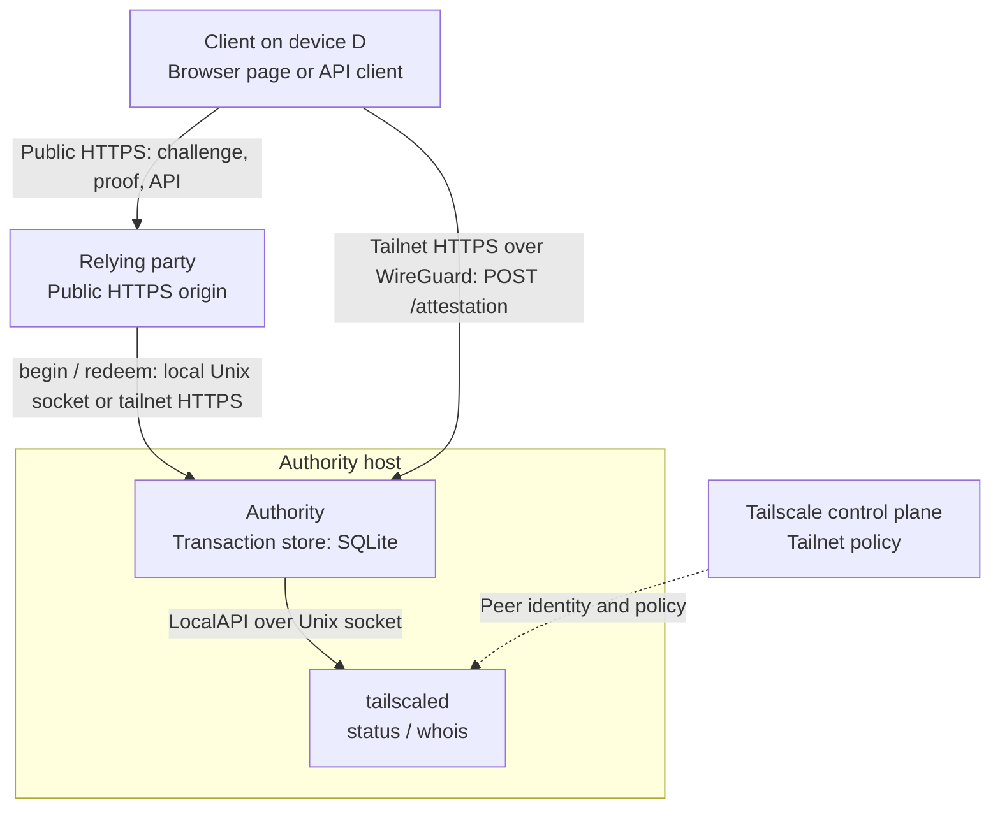
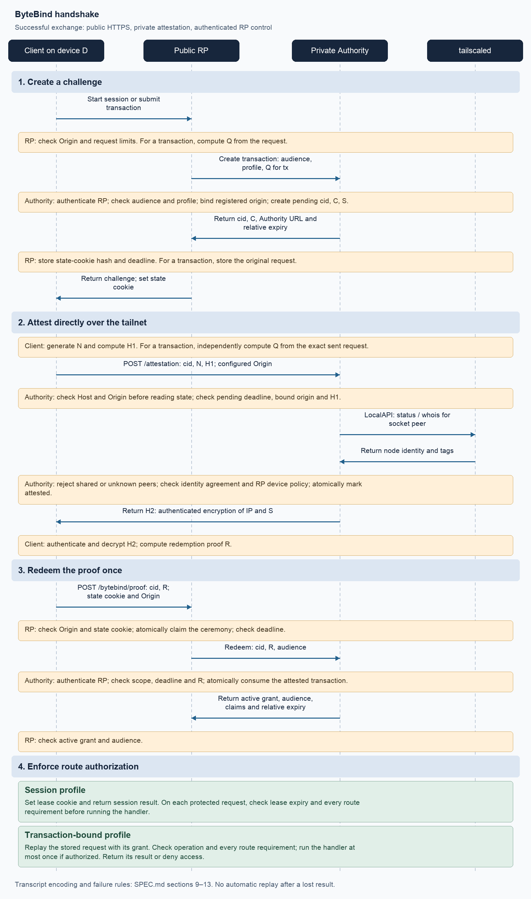

# ByteBind threat model

**Scope:** the protocol (SPEC.md draft 0.7) and the reference implementation: the
Authority (`authority.py`, `store.py`, `config.py`), the Tailscale attestation
provider (`tailscale.py`), Authority discovery (`discovery.py`), the RP core and
FastAPI/Flask bindings (`rp.py`, `binding.py`, `fastapi.py`, `flask.py`), the
browser client (`web/bytebind.js`), the API clients (`client.py`, `requests.py`,
`_client.py`), and the demo deployment (`examples/demo`).

**Basis:** source review as of 2026-10-06 (through commit 78865c4, which adds the
API clients and request-size hardening). Nothing here has been tested on a real
tailnet; see ROADMAP.md, "Verification outstanding".

Severity assumes a typical deployment: one Authority, a few RPs on public
HTTPS origins, and operator devices on a Tailscale tailnet.
Status is **Mitigated**, **Partial**, **Open**, or **Accepted** (a documented
limit of the design).

## 1. System

Trust boundaries:

| # | Boundary | Authenticated by |
|---|---|---|
| B1 | Internet → RP public origin | Nothing before a ceremony; then the lease cookie or a single-use proof |
| B2 | Client → Authority attestation endpoint | Tailnet source address (WireGuard), mapped to a node by tailscaled; `Origin`/`Host` checks; CORS for browsers |
| B3 | RP → Authority control channel | Unix peer UID, or tailnet node identity of the source address |
| B4 | Authority → RP (control responses, grants) | Filesystem permissions on the socket path, or TLS to the Authority's `.ts.net` name |
| B5 | Authority → tailscaled LocalAPI | Unix socket permissions |
| B6 | Tailnet policy → everything | Tailscale admin console and policy-file editors |

### 1.1 Handshake

This sequence shows a successful native ByteBind exchange. Public requests use
HTTPS; attestation travels directly over the tailnet. RP control requests use
the authenticated Unix-socket or tailnet HTTPS channel. For transcript encoding
and failure handling, see SPEC.md sections 9–13.

[Mermaid source](diagrams/handshake.mmd).

The Authority's device policy and the RP's route requirements are separate
checks. An attestation or redeemed grant alone does not authorize every route.
Session renewal repeats the exchange; expiry and route requirements remain
server-enforced. Failure burns and cross-RP rejection rules are detailed in
T-P2 and T-P3. A failed or lost exchange can consume authorization without
executing the operation; a lost operation response can leave its outcome unknown
(T-R5, T-X5).

## 2. Assets

| Asset | Held by | Why it matters |
|---|---|---|
| Lease cookie (`bytebind_session`) | Client | Bearer token for management access until the server-side deadline (≤ 300 s, default 180 s) |
| Transaction approval | Client → RP | Authorizes one stored request, such as a restart or a config change |
| `C`, `S` per transaction | Authority store; `C` also client and RP; `S` revealed to the client by `H2` | Together they let you complete a ceremony |
| `R` | Client → RP → Authority | Single-use proof, valid inside the 10 s redeem window |
| Grant | Authority → RP | Unsigned JSON. The RP trusts whatever its control channel returns |
| Stored transaction requests | RP database | May contain sensitive bodies |
| Device identity (StableID, name, tags, tailnet IP) | Authority, partly the client | Privacy: section 19 of SPEC.md says the RP should learn only what it needs |
| Authorization policy (tags, node allowlists, RP registry) | Authority config, tailnet policy | Defines who gets access |

## 3. What the design trusts

ByteBind depends on these components and permissions. Compromising any of them
defeats its protections for the affected RPs. Deployment docs should name each
trust assumption:

1. **The tailnet's policy editors and tag owners.** Whoever can apply a tag the
   Authority's policy accepts can create authorized devices (T-TS1). Whoever can
   apply `tag:bytebind-authority` or the Authority node capability can become the
   Authority for RPs that use discovery (T-D1).
2. **The Tailscale control plane and tailscaled on the Authority node**, for
   peer identity (`status`, `whois`) and for binding source addresses to node keys.
3. **The Authority host** and its database.
4. **The RP host and all code served from the RP's origin.** A script running on
   the origin can run ceremonies silently (T-B1).
5. **The authorized device** (T-X1). Compromise of that device is outside
   SPEC.md's threat model. ByteBind authenticates its node identity and does
   not isolate individual processes on it.

Operators assign node roles through Tailscale tags, restrict who may assign
those tags, and configure the Authority's device policy and returned claims.
Application developers declare each protected route's required claims. ByteBind
checks the authenticated device claims against those requirements and denies
access when any required claim is missing.

For example, a route with `require=["tag:automated"]` accepts only a device
carrying `tag:automated`; a route with `require=["tag:interactive"]` accepts only
a device carrying `tag:interactive`. A node carrying both tags can satisfy either
route. Listing both tags in one route's `require` requires both, not either.
The Authority must include `tags` in its configured grant claims; omitted tags
cannot satisfy a tag requirement. The node must also pass the Authority's policy.

These tags express operator-assigned device roles. An API client cannot fabricate
them: the Authority obtains tags from tailscaled's authenticated peer metadata,
not from client headers or a claimed client mode. Correctly separating node roles
and route requirements prevents an automation-only node from using an
interactive-only route, and vice versa, for both leases and transaction grants.
Incorrect node tagging or missing route requirements are policy risks (T-TS1,
T-A3, T-X1). Code using the permissions of a legitimately authorized node is a
trust assumption, not a bypass of these checks. A role named `tag:interactive`
does not establish human presence; SPEC.md 3 treats that as a separate requirement.

## 4. Adversaries

| Adversary | Capabilities | In scope |
|---|---|---|
| Internet client | Any HTTP to RP public endpoints; can forge `Origin` | Yes |
| Malicious web page | Runs in an authorized user's browser on a non-registered origin | Yes |
| Unauthorized tailnet peer | Reaches the attestation port; fails policy | Yes |
| Shared-in node | Reaches the tailnet from another tailnet | Yes |
| Other registered RP | Valid control-channel identity; its own origin is registered | Yes |
| Co-resident process on an authorized device | Uses that node's authenticated identity and permitted roles | No process isolation; authorized-device trust assumption (T-X1) |
| Co-resident process on an RP or Authority host | Local socket and file access | Partly (T-A4, T-R1) |
| Network attacker on the public path | TLS-protected | Yes |
| Script running on a registered RP origin (XSS, compromised dependency, extension) | Same-origin script in an authorized browser | Not defended; consequences in T-B1 |
| Thief with a lease cookie | Replays the cookie from anywhere | Yes, bounded by lease TTL |
| Tailnet admin, Authority host root, compromised authorized device | Everything | No |

## 5. Security properties

What ByteBind is meant to guarantee, and the threats that test each:

| # | Property | Threats |
|---|---|---|
| P1 | No lease or approval without a fresh attestation from a policy-authorized node | T-X1, T-TS1, T-TS2, T-D1, T-R1 |
| P2 | An attestation for RP A can't be used at RP B | T-P2 |
| P3 | Each challenge, proof, and transaction is used at most once, even under concurrency | T-P3, T-R5 |
| P4 | A transaction-bound approval covers exactly the request the client sent | T-R4, T-B1 |
| P5 | Access ends within one lease TTL after the device stops qualifying | T-R2, T-TS3 |
| P6 | The RP learns only the claims registered for it | T-PR1 |
| P7 | An internet client can't exhaust Authority or RP state | T-AV1 to T-AV3 |
| P8 | A protected handler runs only when the authenticated device grant or lease satisfies every route requirement | T-TS1, T-A3, T-X1 |

## 6. Threats

### 6.1 Protocol

**T-P1. Transferable secrets. Accepted.** Anyone holding `C` can drive an
attestation, and anyone holding `S` can redeem. An authorized participant can
deliberately relay a challenge for someone else (SPEC.md 3). These secrets are
not bound to a process; the design depends on keeping them out of reach.

**T-P2. Cross-RP relay. Mitigated.** RP A's page or client attests a challenge
obtained from RP B. Authority check 4 requires the request `Origin` to equal
the `allowed_origin` stored with the `cid`. `Control.begin` takes that origin
from B's registration; B cannot supply a different value. Redemption checks
`rp_id` and audience, and refuses without burning when they don't match, so one
RP can't burn another's transactions (`store.redeem`). This depends on clients
sending an honest `Origin`. Browsers always do. The API clients must (invariant I1).

**T-P3. Replay and race. Mitigated.** Each transition is a conditional
`UPDATE` that must change exactly one row. Failures burn only from the expected
state. Connections use autocommit, so a burn can't be rolled back. A `cid` is
128 random bits, and each one allows a single `H1` or `R` guess before it burns.
The RP also claims a ceremony with a `DELETE` before redemption, so a repeated
proof submission can't execute a stored request twice.

**T-P4. Downgrade and cross-profile confusion. Mitigated.** The session and
`tx` profiles use different labels. `profile` and `Q` must agree at
`begin`. The predecessor `tailbind/*` labels aren't accepted.

### 6.2 Authority

**T-A1. Attestation from an unauthorized source. Mitigated.** The peer address
comes from the socket, and uvicorn runs with `proxy_headers=False`. The
Authority requires a tailnet address, a known peer that is not shared in
(`ShareeNode`, `Sharer`), agreement between `status` and `whois` on the
StableID, and a policy match.
The listener refuses to bind anything but a tailnet address. It depends on
WireGuard binding source IPs to node keys, which is a trust assumption (§3.2).

**T-A2. DNS rebinding and alternate hostnames. Mitigated.** `Host` must match
`attest_url` before any state is read. Preflights succeed only for registered
origins, `POST`, and `Content-Type`.

**T-A3. Policy weaker than intended. Partial.** `tag_match` defaults to `any`.
An RP registered with `tags = ["tag:mgmt", "tag:ops"]` and no `tag_match`
accepts a node carrying either tag. `config.parse` validates syntax but can't
tell intent. **Recommendation:** require `tag_match` to be set explicitly
whenever more than one tag is listed. Log the effective policy at startup.

**T-A4. Co-resident RP impersonation over the control channel. Partial.**
The Authority identifies RPs by Unix UID or by tailnet node. On an RP host
reached over HTTPS, *every process on that node* is the RP. Another process
there can:

- create transactions until it hits the RP's `max_pending_per_rp`, which locks
  out real ceremonies (T-AV1);
- redeem proofs that reach it. It can't make the real RP honor the resulting
  grant, though, because grants aren't bearer tokens.

A process can't use another RP's identity or `cid`s. **Recommendation:**
document that one node or UID equals one RP. For HTTPS, consider an optional
per-RP credential or mTLS (SPEC.md 16.3 already allows it).

**T-A5. Authority holds broad tailscaled privileges. Open (deployment).**
`status` and `whois` go through the LocalAPI socket. On Linux, access to that
socket is usually all-or-nothing: root or the `--operator` user. A process with
it can also change the node's preferences or log the node out. A compromise of
the Authority's network-facing code would then reach tailscaled.
**Recommendation:** document the minimum access. Run the attestation listener
under a dedicated user. Track whether tailscaled offers a read-only scope.

**T-A6. Control-channel parsing on the Unix socket. Low, Open.** The handler
uses `str.isdigit()` and `int()` on `Content-Length` rather than
`declared_fits`. Inputs like `"²"` or a 5,000-digit length raise, and the
handler drops the connection. Only registered UIDs get this far.
`ThreadingMixIn` has no thread cap. **Recommendation:** reuse `declared_fits`.

**T-A7. Secrets at rest. Low, Partial.** The store holds `C` and `S` in
plaintext. Redeemed and burned rows are deleted only by `cleanup()`, which runs
on the next `begin`. Expired pending rows keep their secrets until then. These
secrets are dead after expiry, but the database and its backups should be
protected anyway. **Recommendation:** create the database with mode 0600, and
also run cleanup on a timer.

**T-A8. Wall-clock dependence. Low, Accepted.** Windows and leases use
`time.time()`. A backward clock step lengthens attestation and redeem windows
and RP leases. Durations are capped (30 s, 10 s, 300 s), so the effect is
bounded.

### 6.3 Tailscale provider and tailnet policy

**T-TS1. Tag owners can mint authorized devices. High (deployment), Accepted with guidance.**
Policy works on tags. Anyone listed in `tagOwners` for an accepted tag can tag
any node they control: a new VM, a container running `tailscaled`, a phone.
The `examples/tailscale` patch gives `autogroup:admin` ownership, which is the
narrowest reasonable choice. **Recommendation:** treat tag ownership as
part of the authorization boundary in docs. Use `nodes` allowlists for high-value
RPs. Consider Tailscale device approval and Tailnet Lock.

**T-TS2. Tagged devices lose user identity and key expiry. Medium (deployment), Open.**
A tagged node belongs to the tag, not to a person. Grants can't say whose laptop
approved a transaction, and node-key expiry is off by default for tagged nodes,
so a stolen tagged laptop stays authorized until someone removes it.
**Recommendation:** document both points. For human admin devices, evaluate user-owned devices
plus app capabilities (ROADMAP: "app capabilities vs tags") or posture checks.
Add the device's user to grants once the provider can map it reliably.

**T-TS3. Network paths that inherit a node's identity. Medium, Open.**
The Authority attests *the tailnet address the connection came from*. Every one
of these shows up as the authorized node:

- other OS users and processes on the node (T-X1);
- containers whose traffic is NATed out through the host's `tailscale0`;
- clients of tailscaled's `--socks5-server` or `--outbound-http-proxy-listen`,
  including other hosts if the listener isn't loopback-only;
- LAN hosts behind a subnet router that SNATs into the tailnet.

**Recommendation:** in deployment guidance, never tag subnet routers,
container hosts, CI runners, multi-user hosts, or nodes running tailscaled proxy
listeners with an accepted tag.

**T-TS4. LocalAPI field drift. Low, Open (ROADMAP).** Parsing fails closed when
it sees unknown shapes. A future change in what `ShareeNode` or `Sharer` mean
could fail *open*. **Recommendation:** pin tests to recorded responses from each
supported tailscaled version.

### 6.4 Authority discovery (RP side)

**T-D1. A rogue Authority via tag or capability. High (deployment), Partial.**
With no `BYTEBIND_AUTHORITY` set, the RP uses whichever single online node carries
`tag:bytebind-authority` or the `bytebind.example/authority` capability,
including itself. Grants are unsigned, so whoever controls that node can issue
any grant. Shared, expired, and offline nodes are excluded, and TLS is verified
against the node's MagicDNS name. Anyone who can apply the tag or edit
`nodeAttrs` can become the Authority. A second advertised Authority causes
a "multiple Authorities" error, which also makes it a DoS lever.
**Recommendation:** set `BYTEBIND_AUTHORITY` in production (the demo env has it
commented out). Document discovery as trusting tag owners. Longer term, pin the
Authority's StableID, or sign grants (ROADMAP "managed Authority profile").

**T-D2. The RP doesn't authenticate the Unix-socket Authority. Medium, Open.**
`DiscoveringAuthorityClient` uses `/run/bytebind/control.sock` whenever that
path *is a socket*. An explicit `unix:` endpoint is used as given. In both
cases the RP doesn't check who owns the socket or whether its directory is
writable by others. The Authority checks its own directory when it starts, but
nothing stops another local user from creating the path first, or from
replacing it while the Authority is down, if `/run/bytebind` is writable by
them. A process that controls the socket returns forged grants, and the RP
accepts them. **Recommendation:** on the RP, require the socket and its parent
directory to be owned by root or by a configured Authority UID and not be
group- or world-writable. Better, check the server's peer credentials
(`SO_PEERCRED` or `getpeereid`) against that UID on every connection.

**T-D3. Re-resolution between begin and redeem. Low, Open (ROADMAP).**
Discovery runs on every control call. If the set of advertised Authorities
changes between `begin` and `redeem`, redemption goes to a different Authority
and fails closed. **Recommendation:** record the Authority per `cid`, as the
roadmap already plans.

### 6.5 Relying party and bindings

**T-R1. Forged grant acceptance. see T-D1 and T-D2.** The RP validates only that
the grant has `active: true` and the matching `audience`. That's correct while the
channel is authenticated, so the channel is the whole defense.

**T-R2. Lease cookie theft. Medium, Accepted.** The lease is a bearer cookie,
not bound to the device (SPEC.md 3). Theft paths include the browser profile,
malware, proxies or logs that record cookies, and API-client cookie jars.
Mitigations: `HttpOnly`, `Secure`, `SameSite=Strict`, server-side deadlines,
renewal rotates the token and deletes the old one, and lease length is capped at
the grant TTL (≤ 300 s). A stolen token dies at the victim's next renewal (at
most 60 s while a page or client is active). If the victim is idle, it lives out
the rest of the lease. Use the transaction profile for operations where
three minutes of reuse is unacceptable.

**T-R3. Cookie tossing from sibling subdomains. Low, Open.** The cookies are
host-only but don't use the `__Host-` prefix. A sibling subdomain or a
plain-HTTP response on the same host can set `bytebind_session` or
`bytebind_state` with `Domain=` or a narrower `Path`. That shadows or overrides
the real cookie and breaks ceremonies or sessions. It can't produce a valid
lease. `SameSite=Strict` treats siblings as same-site, so non-GET lease routes
depend on the Origin check, which does exist. **Recommendation:** rename the
cookies to `__Host-bytebind_session` and `__Host-bytebind_state`. The state
cookie would then need `Path=/`.

**T-R4. Transaction replay runs with the proof request's ambient state. Medium, Open.**
`Q` covers the method, target, `Content-Type`, and body (`COVERED_HEADERS`).
On replay, `_replay` builds the request from the stored request plus the
*proof submission's* other headers, including its cookies and `Authorization`.
Consequences:

- whoever submits the proof decides the ambient credentials the approved request
  runs with. With transferable proofs (T-P1), a relayer's own application
  session is attached to someone else's approval;
- headers the original request carried (idempotency keys, `If-Match`, tenant
  selectors) never reach the handler. The API clients send caller headers only
  on the challenge request (T-X3).

**Recommendation:** in the spec and binding docs, say that a transaction-bound
handler must authorize from the stored request plus the grant, never from
ambient headers. Either strip ambient credentials at replay or extend the
covered headers.

**T-R5. At-most-once execution. Mitigated.** The ceremony row is deleted before
redemption, and the grant's `operation` must match the route that the stored
target resolves to. A transient Authority failure after the claim loses the
request: it fails closed, and the client must start over.

**T-R6. Origin derived from `Host` when unset. Low, Open.** Without
`BYTEBIND_ORIGIN`, `Core.rp_for` builds an RP from `request.base_url`. Any
`Host` header produces a matching "origin" for the RP's own Origin checks.
Attestation still fails, because the Authority uses the registered origin.
Requests with new hosts beyond the 32-entry cache create a fresh
`RelyingParty` each time. **Recommendation:** require a configured origin, or
refuse a `Host` that doesn't match one. The demo already uses
`TrustedHostMiddleware`.

**T-R7. Rate limiting keyed by the wrong address. Medium (deployment), Partial.**
`challenge_per_minute` is keyed by `request.client.host` (FastAPI) or
`remote_addr` (Flask). Behind a proxy that isn't configured to pass the real
client address, every user shares one 30-per-minute bucket. With a
misconfigured trusted-proxy list, `X-Forwarded-For` can be spoofed to dodge the
limit. The demo sets both up correctly. **Recommendation:** document this
next to `challenge_per_minute`.

### 6.6 Browser client

**T-B1. Script on the RP origin gets full authority silently. High, Accepted (design).**
Ceremonies run in the background without user interaction. Any script executing on a registered origin in an authorized
browser can therefore obtain leases *and* approve any transaction-bound request
it builds: XSS, a compromised third-party script, a malicious extension.
`HttpOnly` doesn't help. The transaction profile proves that *the client* sent
the request. It does not establish a person's intent. Other RPs aren't affected (T-P2).
**Recommendation:** state this plainly in the README. Recommend a strict CSP and
no third-party scripts on management origins. For destructive operations,
layer a user-presence check such as WebAuthn on top, as SPEC.md 3 suggests.

**T-B2. Unattended sessions. Medium, Accepted.** An open management tab on a
device that stays on the tailnet renews indefinitely, including on a locked or
unattended machine. P5 depends on the device leaving the network or the
policy, not on the user leaving. **Recommendation:** an optional absolute
session cap at the RP (a maximum lifetime regardless of renewals) and
idle detection in the renewal script.

**T-B3. Browser local-network permission prompts. Availability, Open
(ROADMAP).** Browsers' local-network permission rules may classify
`100.64.0.0/10` as private and prompt the user, which breaks silent renewal.
Users trained to accept such prompts aren't exposed further, because check 1
still refuses unregistered origins.

### 6.7 API clients

The API clients run the same ceremony without a browser. Without the browser's
honest `Origin` and CORS enforcement, the protections listed under "malicious
pages" in SPEC.md 6 don't apply to native code.

**T-X1. Device roles and route requirements. Accepted trust boundary; policy mistakes remain deployment risks.**
Operators decide which nodes carry `tag:automated`, `tag:interactive`, or both.
Developers require the corresponding claims on routes. ByteBind enforces those
requirements using Authority-issued claims derived from authenticated Tailscale
metadata. Changing client headers, switching between a browser and Python, or
claiming another access mode cannot supply a missing device tag.

An automation-only node is denied on an interactive-only route. A node carrying
both tags is permitted on either route if the Authority's policy also allows it.
Failing to require a role on a route or assigning that role to the wrong node
weakens this separation. Missing tag claims fail closed.

Any process on a legitimately authorized node can use that node's permitted
roles. ByteBind does not attest process identity or human intent; compromise of
an authorized device is explicitly outside SPEC.md 3's threat model. This is not
a failure of route authorization. Delegated network paths, including a full-read
SSRF with header control or a proxy, still need deployment review under T-TS3:
they can expose a node's identity to callers beyond that device.

**Recommendation:** restrict tag ownership, assign automation and interactive
roles deliberately, return the needed tag claims, and require the appropriate
role on each protected route. Use the transaction profile when approval must
cover one exact request. Add user presence only where the application requires
human approval.

**T-X2. The RP picks the Authority URL. Medium, Open.** The clients POST to any
HTTPS `authority` named in a challenge. Relay through the client is still
blocked by I1 and T-P2. What a malicious or compromised RP gains is a narrow
SSRF from the authorized node: a fixed path and body to any HTTPS host and port,
including tailnet-internal ones. It also gets a reachability timing oracle.
**Recommendation:** an optional `authority=` pin, checked before any private I/O.

**T-X3. Transaction headers dropped. Medium, Open.** The client side of T-R4.
`headers=`, `auth=`, and `cookies=` passed to `transaction()` go out only on the
challenge request. **Recommendation:** reject anything outside the covered
headers and `Accept` until T-R4 is settled.

**T-X4. Transport downgrade. Low, Partial.** Both clients set
`trust_env=False` and turn off redirects. The requests client also rejects
`verify=False` and retrying adapters. Gaps:

- the httpx `transport=`/`attestation_transport=` arguments accept an insecure
  transport without complaint;
- neither client takes a CA bundle for a private-CA Authority, which invites
  disabling verification.

**Recommendation:** add `authority_verify=`, and rename or warn on test transports.

**T-X5. Ambiguous transaction outcome. Low, Partial.** Nothing is retried at
any layer, which is correct. But `ClientError("proof")` doesn't distinguish
"never sent" from "sent, outcome unknown". **Recommendation:** add an
`ambiguous` flag.

**T-X6. Secrets in error reports and logs. Low, Open.** Exceptions are chained,
so error reporters that capture frame locals (Sentry by default) can record the
cookie jar, the `Ceremony`, and `R`. The httpx and urllib3 logs include
transaction URLs with their query strings. **Recommendation:** document this;
use `raise … from None` on ceremony steps.

**T-X7. Client availability. Low, Open.**

- A failed renewal raises instead of sending the call on a lease that's still
  valid (SPEC.md 15.2).
- The lock is held across the API call itself.
- After `fork()`, parent and child share a token, and the first renewal logs
  the other out.

### 6.8 Availability

**T-AV1. Unauthenticated ceremony starts exhaust the Authority's per-RP quota. Medium, Partial.**
Each challenge holds a pending transaction for 30 s. With
`max_pending_per_rp = 200` and 30 starts per minute per address, about 14 source
addresses can keep an RP's quota full. Real users then can't start or renew,
and every lease expires within one TTL. Limits keep the state bounded, but
nothing stops this lockout. **Recommendation:** document the arithmetic. Size
the quota to the expected attack. Consider a stricter per-/24 or per-/64 limit,
or a cheap proof of work on `/bytebind/challenge`. Track this as a known limit
of unauthenticated access requests (SPEC.md 10.2).

**T-AV2. One page can use up a device's attestation budget. Low, Open.** The
Authority's `PeerLimiter` is keyed by device address and shared across all
RPs. A page on any registered origin that loops attestation attempts locks that
device out of every RP for a minute. **Recommendation:** key the limiter by
(peer, origin).

**T-AV3. Tailscaled load per request. Low, Open.** Every attestation, and
every HTTPS control request, calls `status` (up to 4 MiB) and `whois`. On large
tailnets this amplifies T-AV1. **Recommendation:** cache `status` briefly, or
use `whois` alone.

**T-AV4. A single Authority. Accepted.** Failover isn't defined yet (ROADMAP
draft 0.8).

### 6.9 Privacy

**T-PR1. The RP's code learns the device's tailnet IP. Medium, Open.**
`H2` decrypts to `IP || S`, and the client does the decrypting. In a browser,
that's JavaScript served by the RP. Every RP therefore learns the tailnet
address of each authorized device that visits it, even with `claims = []`, and a tailnet
address identifies the node. That contradicts SPEC.md 19's
selective-disclosure goal. **Recommendation:** document it as a limit, or
change the transcript in a future version so the client gets a value
derived from `IP` rather than `IP` itself.

**T-PR2. The Authority logs node names. Low.** `attested … name=` and
`granted … node=` are logged at INFO. That's expected for audit, but name it in
the operations docs and set log retention to match.

**T-PR3. Silent fingerprinting by registered RPs. Low, Accepted.** Background
ceremonies tell an RP whether a visitor's device is authorized for it, without
any user action. This is limited to RPs the operator registered.

## 7. Invariants and test coverage

| # | Invariant | Test |
|---|---|---|
| I1 | API clients send the configured origin to the Authority, never a value from the RP, the challenge, or the caller | **None** |
| I2 | No lease cookie, caller header, or caller auth reaches the Authority | Partial: the request is built bare, but no test asserts it |
| I3 | Client API and ceremony URLs stay on the configured origin | `test_cross_origin_calls_fail_before_io`, `test_foreign_urls_fail_before_ceremony` |
| I4 | No redirects, no automatic retries | `test_*redirect*`, `test_*not_replayed`, `test_retry_adapter_is_rejected_before_io` |
| I5 | Verification is on; environment proxies and `netrc` are ignored | `test_insecure_tls_is_rejected_before_io` (requests only); environment: none |
| I6 | Failures burn only from the expected state; cross-RP redemption doesn't burn | `test_attest_is_single_use_and_a_race_loser_does_not_burn_the_winner`, `test_another_rp_cannot_redeem_and_cannot_burn`, `test_wrong_r_burns` |
| I7 | `Q` is computed by the client and never taken from the RP | End-to-end transaction tests |
| I8 | The RP accepts grants only from an authenticated Authority | **None** for Unix-socket ownership (T-D2) |
| I9 | The attestation endpoint reads no state before checking `Origin` and `Host` | `test_attest.py` |
| I10 | Error messages carry no secrets | Implicit only |

## 8. Prioritized work

1. **T-D2:** authenticate the Unix-socket Authority from the RP: check ownership
   and mode, ideally peer credentials. This is a code fix for a forged-grant path.
2. **T-D1, T-TS1, T-TS2, T-TS3, T-X1:** a deployment-security section in the
   README covering who can mint authorized devices or Authorities, which nodes
   must never carry accepted tags, and setting `BYTEBIND_AUTHORITY` in production.
3. **T-B1:** document that origin code is fully trusted. Recommend CSP and
   step-up user presence for destructive transactions.
4. **T-R4 and T-X3:** decide the ambient-state rule for replay. Until then,
   reject uncovered headers in the API clients.
5. **I1 test** and **T-X2** `authority=` pin.
6. **T-AV1:** document quota arithmetic. Consider per-prefix limits.
7. **T-PR1:** record it as a known limit in SPEC.md 19, or plan a v2 change.
8. Smaller fixes: T-R3 (`__Host-` cookies), T-A3 (explicit `tag_match`), T-A6,
   T-A7, T-R6, T-AV2, T-AV3, T-X4, T-X5, T-X7.
